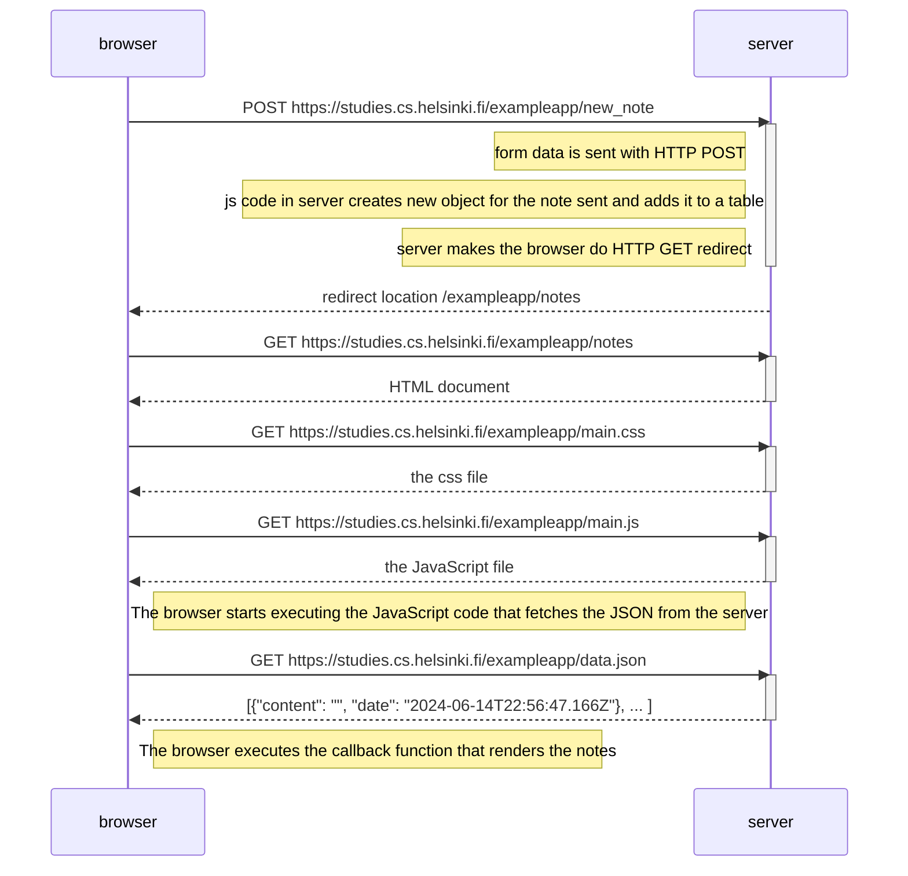

```mermaid

sequenceDiagram
    participant browser
    participant server
    
    browser->>server: POST https://studies.cs.helsinki.fi/exampleapp/new_note
    activate server
    

    Note left of server: form data is sent with HTTP POST
    Note left of server: js code in server creates new object for the note sent and adds it to a table
    Note left of server: server makes the browser do HTTP GET redirect

    deactivate server
    server-->>browser: redirect location /exampleapp/notes
    
    browser->>server: GET https://studies.cs.helsinki.fi/exampleapp/notes
    activate server
    server-->>browser: HTML document
    deactivate server
    
    browser->>server: GET https://studies.cs.helsinki.fi/exampleapp/main.css
    activate server
    server-->>browser: the css file
    deactivate server
    
    browser->>server: GET https://studies.cs.helsinki.fi/exampleapp/main.js
    activate server
    server-->>browser: the JavaScript file
    deactivate server
    
    Note right of browser: The browser starts executing the JavaScript code that fetches the JSON from the server
    
    browser->>server: GET https://studies.cs.helsinki.fi/exampleapp/data.json
    activate server
    server-->>browser: [{"content": "", "date": "2024-06-14T22:56:47.166Z"}, ... ]
    deactivate server    

    Note right of browser: The browser executes the callback function that renders the notes

```
