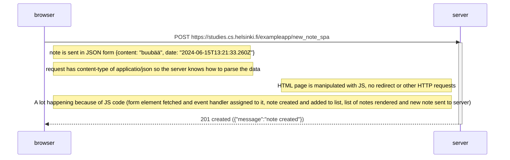

```mermaid

sequenceDiagram
    participant browser
    participant server
    
    browser->>server: POST https://studies.cs.helsinki.fi/exampleapp/new_note_spa
    activate server
    Note right of browser: note is sent in JSON form {content: "buubää", date: "2024-06-15T13:21:33.260Z"}
    Note right of browser: request has content-type of applicatio/json so the server knows how to parse the data
    
    Note left of server: HTML page is manipulated with JS, no redirect or other HTTP requests
    Note left of server: A lot happening because of JS code (form element fetched and event handler assigned to it, note created and added to list, list of notes rendered and new note sent to server)
    server-->>browser: 201 created ({"message":"note created"})
    deactivate server

```
